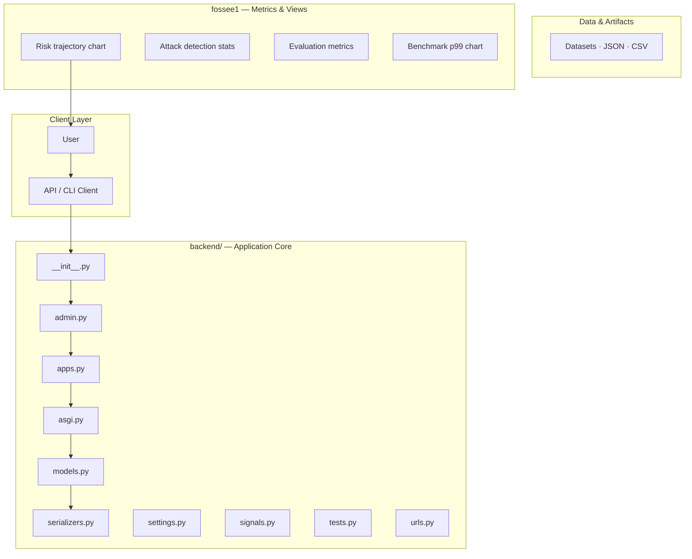
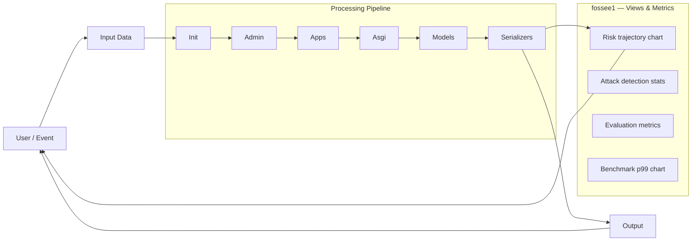
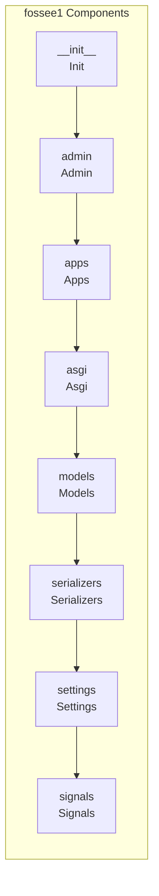
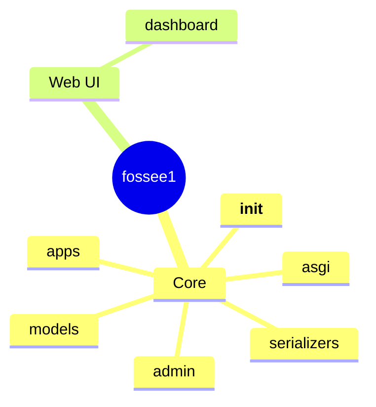

# Chemical Equipment Parameter Visualizer System Analysis

A multi-client, three-tier application designed to ingest, process, and visualize chemical equipment operational parameters using a central Django REST API.

## Overview

The system is a comprehensive data visualization platform built around a central Django REST Framework (DRF) backend. It supports multiple client interfaces—a web frontend (React) and a desktop application (PySide6)—to consume processed data. The core functionality involves ingesting raw data (e.g., CSV files), performing complex calculations and data cleaning using Pandas, and presenting the results through various visualization formats, including interactive web dashboards and printable PDF reports.

## Problem

The need for a centralized, reliable, and multi-platform system to ingest disparate operational data (like chemical equipment parameters) and transform it into actionable, visualized insights for various stakeholders (web users, desktop analysts).

## Solution

The solution implements a three-tier architecture: a robust Django backend for data persistence and business logic; a React web frontend for browser-based visualization; and a PySide6 desktop client for specialized, offline, or high-fidelity reporting tasks.

## Key Features

- Data Ingestion: Accepts raw data uploads (e.g., CSV) via the API.
- Parameter Processing: Performs complex data cleaning, calculation, and parameter extraction using Pandas.
- Authentication: Implements user authentication and authorization via the API.
- Web Dashboard Visualization: Provides an interactive, browser-based dashboard for real-time parameter viewing (React/Chart.js).
- Desktop Visualization: Offers a dedicated desktop client for specialized visualization and reporting (PySide6/Matplotlib).
- Report Generation: Supports generating downloadable PDF reports summarizing the analyzed parameters.

## Technology Stack

- Python
- Django
- Django REST Framework (DRF)
- React
- JavaScript
- PySide6
- Pandas
- Chart.js
- Matplotlib

# 📊 Fossee1: Equipment Data Analysis Platform

Fossee1 is a comprehensive web and desktop application designed for the ingestion, analysis, and reporting of equipment operational data. It provides a centralized platform for visualizing trends, generating detailed reports, and maintaining a historical record of asset performance.

## ✨ Features

*   **Data Ingestion:** Supports CSV file uploads for easy data integration.
*   **Summary Statistics:** Provides immediate statistical insights (min, max, average, etc.) upon data upload.
*   **Visualization:** Generates interactive charts (line, bar, etc.) to visualize trends over time.
*   **Data Table:** Displays raw and processed data in a sortable, filterable table.
*   **Reporting:** Generates professional, downloadable PDF reports summarizing the analysis.
*   **History Tracking:** Maintains a complete log of all uploaded data and analyses.
*   **Authentication:** Secure user login system to protect sensitive operational data.

## 🚀 Getting Started

This guide will walk you through setting up the application locally.

### Prerequisites

Before you begin, ensure you have the following installed:

*   Python 3.10+ (Recommended)
*   Node.js 18+ (Recommended)
*   pip (Python package installer)
*   npm (Node Package Manager)

### Installation

Follow these steps to set up the backend, frontend, and desktop components.

**1. Clone the Repository**

```bash
git clone <repository-url>
cd fossee1
```

**2. Setup Backend (Python)**

```bash
# Install Python dependencies
pip install -r backend/requirements.txt
```

**3. Setup Frontend (Node.js)**

```bash
# Navigate to the web directory
cd frontend
# Install Node dependencies
npm install
```

**4. Setup Desktop Client (Optional)**

```bash
# Navigate to the desktop directory
cd desktop
# Install dependencies
npm install
```

### Running the Application

**1. Start the Backend Server**

```bash
# Run the Flask application
python backend/app.py
```

**2. Start the Frontend Web App**

```bash
# Run the React development server
cd ../frontend
npm start
```

**3. Run the Desktop Client**

```bash
# From the desktop directory
cd ../desktop
npm run dev
```

> **Note:** The application is designed to run across multiple components (Backend API, Frontend Web UI, and Desktop Client). Ensure all services are running simultaneously for full functionality.

## 💾 Data Handling

### CSV Upload

The platform accepts data via CSV upload. The expected structure for the CSV file is:

| Column Name | Description | Example Data |
| :--- | :--- | :--- |
| `timestamp` | The time the reading was taken. | `2023-10-26 10:00:00` |
| `equipment_id` | Unique identifier for the equipment. | `E1001` |
| `reading_type` | Type of measurement (e.g., temperature, pressure). | `Temperature` |
| `value` | The measured numerical value. | `75.5` |

### Sample Data

For testing, you can use the provided sample CSV file located in the root directory.

## 🌐 API Reference

All API endpoints are managed by the backend server and are accessible via the following routes:

| Endpoint | Method | Description | Request Body | Response | 
| :--- | :--- | :--- | :--- | :--- |
| `/api/auth/login` | `POST` | Authenticates user credentials. | `{username, password}` | `{token}` |
| `/api/data/upload` | `POST` | Processes and stores uploaded CSV data. | `multipart/form-data` (file) | `{status, records_processed}` |
| `/api/data/summary` | `GET` | Retrieves summary statistics for the latest data set. | None | `{min, max, avg, count}` |
| `/api/data/history` | `GET` | Fetches historical data records. | `?equipment_id=E1001` | `[{...}]` |
| `/api/report/generate` | `POST` | Generates a PDF report based on selected parameters. | `{start_date, end_date}` | `file:pdf` |

## 📐 System Architecture

For developers interested in the system design, the architecture is composed of three main services communicating via RESTful APIs.

### Architecture Diagram

## 🖼️ UI Overview

The application features a secure login page and a main dashboard for data visualization and management.

*   **Login Page:** The initial entry point for authenticated users.
*   **Dashboard:** The primary workspace featuring data upload controls, summary charts, and the data table.

## 📚 Development & Contribution

We welcome contributions! Please feel free to open an issue or submit a pull request.

## 📄 License

This project is licensed under the MIT License. See the `LICENSE` file for details.

## Setup Guide

### Backend Setup

_From `README.md`:_


### Prerequisites

- Python 3.10+
- Node.js 18+
- pip, npm

### Backend Setup

```bash
cd backend
python -m venv venv

# Windows
.\venv\Scripts\Activate.ps1

# Linux/Mac
source venv/bin/activate

pip install -r requirements.txt
python manage.py migrate
python manage.py createsuperuser  # Optional, for admin access
python manage.py runserver
```

Backend runs at **http://localhost:8000**

### Web Frontend Setup

```bash
cd web-frontend
npm install
npm run dev
```

Web app runs at **http://localhost:5173**

### Desktop Frontend Setup

```bash

### Frontend Setup

```bash
cd web-frontend
npm install
npm run dev     # development
npm run build && npm start   # production
```

Open `http://127.0.0.1:5173` (or the port shown in the terminal).

### Running the Application

1. **Install dependencies** in `backend/`
2. **Start web app** — `npm run dev` in `web-frontend/`

```bash
cd backend
pip install -r requirements.txt

cd web-frontend
npm install
npm run dev
```

## System Architecture

High-level system design, data flows, API map, and workflow pipelines derived from the repository structure.

### System Architecture



### Data Flow & Charts Pipeline



### Component & API Map



### Application Page Map



## Application Pages

Screenshots captured from the running application. Each page is listed with its function.

### Public

#### Login

Login — application page at `/login`


