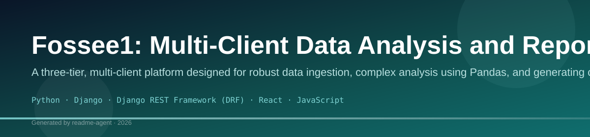
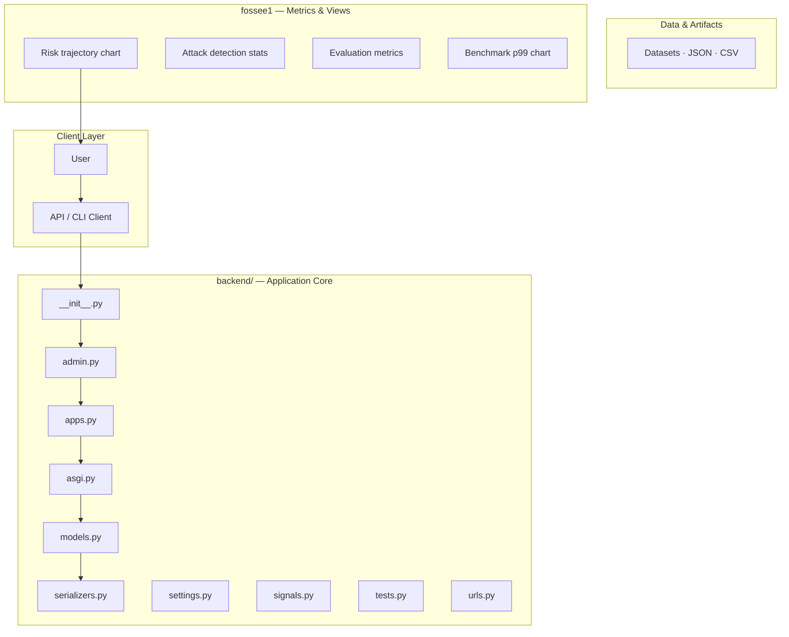
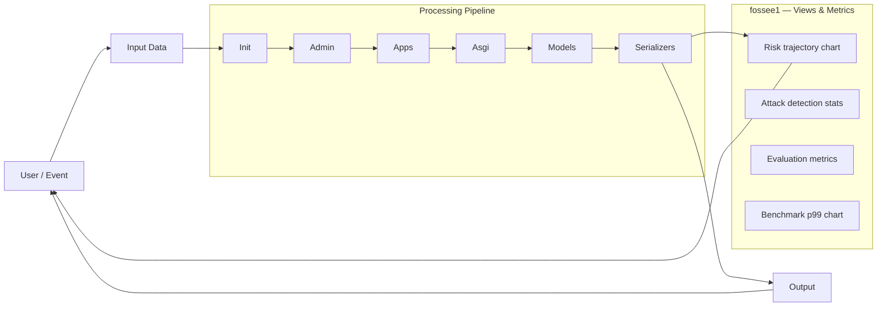
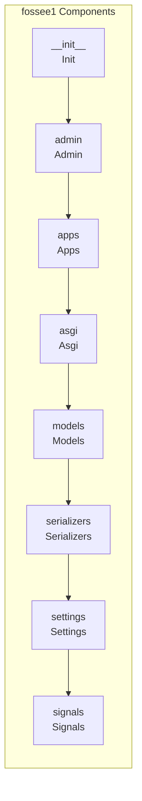
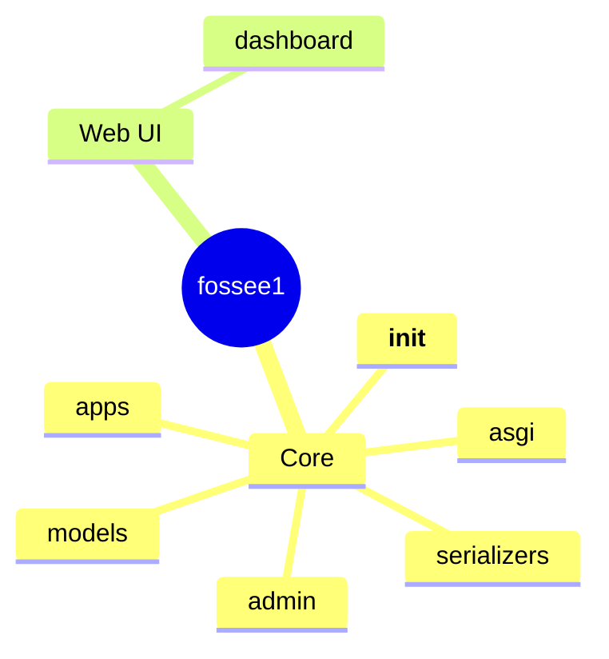
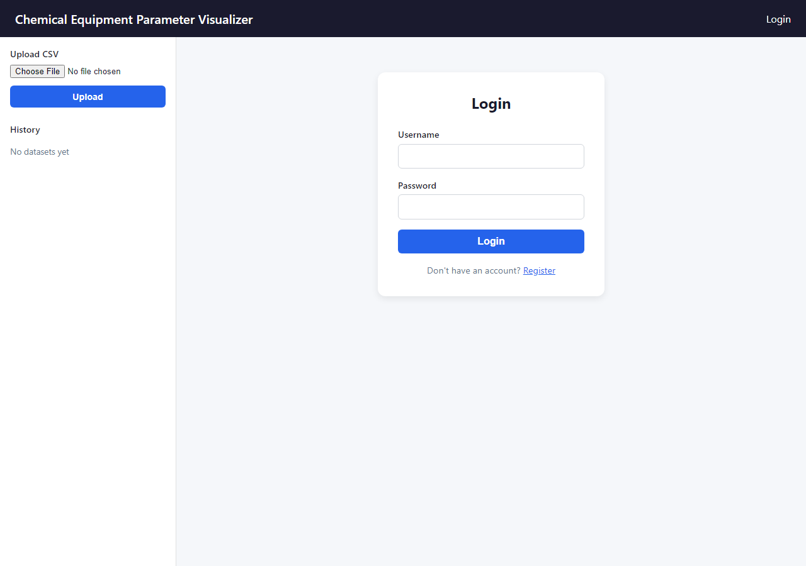

# Fossee1: Multi-Client Data Analysis and Reporting Platform

A three-tier, multi-client platform designed for robust data ingestion, complex analysis using Pandas, and generating comprehensive reports via web dashboard and desktop applications.

## Overview

Fossee1 is a sophisticated data analysis system built on a three-tier architecture (Django Backend, React Web Frontend, and PySide6 Desktop Client). Its primary function is to ingest disparate data sources (e.g., CSV uploads), process them through a defined pipeline, and provide visualization and reporting capabilities across multiple user interfaces. The system is designed to handle complex business logic, data persistence, and output generation (PDF reports, charts).

## Problem

The system addresses the challenge of managing and analyzing data from disparate sources that require standardized processing, visualization, and reporting. The need for multiple access points (web dashboard for general use, desktop client for specialized tasks, and API for integration) necessitates a robust, centralized backend.

## Solution

The solution implements a centralized Django backend that acts as the core processing engine. Data is ingested via file uploads or API calls, processed using Pandas, and then exposed through RESTful APIs. The results are consumed by specialized frontends: a React SPA for the web dashboard, and a PySide6 application for a dedicated desktop experience.

## Key Features

- CSV File Upload and Ingestion
- Pandas-based Data Processing and Transformation
- Web Dashboard Visualization (React/Chart.js)
- Desktop Application Interface (PySide6)
- PDF Report Generation (ReportLab)
- Authentication and Authorization (JWT)
- Multi-Client Access (Web, Desktop, API)

## Technology Stack

- Python
- Django
- Django REST Framework (DRF)
- React
- JavaScript
- PySide6
- Pandas
- ReportLab
- Matplotlib
- JWT

# Project Title

[](https://opensource.org/licenses/MIT)

Project Title is a comprehensive, full-stack application designed to manage complex data workflows, providing both a robust backend API and an intuitive frontend user interface. It facilitates the ingestion, processing, and querying of structured and unstructured data.

## ✨ Features

*   **Data Ingestion:** Supports multiple data sources, allowing users to upload files and connect to external APIs.
*   **Workflow Automation:** Manages multi-step data processing pipelines, ensuring data integrity from source to final output.
*   **RESTful API:** Provides a secure, well-documented API gateway for programmatic access and integration with other services.
*   **User Authentication:** Implements secure user management and role-based access control.
*   **Real-time Querying:** Enables complex data querying and visualization through the frontend dashboard.

## 🚀 Getting Started

These instructions will get you a copy of the project up and running on your local machine for development and testing purposes.

### Prerequisites

Ensure you have the following installed:

*   **Node.js:** (LTS version recommended)
*   **Python 3.10+**
*   **npm**

### Installation

1.  **Clone the Repository:**
    ```bash
git clone [REPOSITORY_URL]
cd ProjectTitle
```

2.  **Backend Setup (Python/Django):**
    The backend handles data processing and API logic.
    ```bash
# Create and activate a virtual environment
python3 -m venv venv
source venv/bin/activate  # On Windows: venv\Scripts\activate

# Install dependencies
pip install -r backend/requirements.txt
```

3.  **Frontend Setup (Node.js/React):**
    The frontend provides the user interface.
    ```bash
# Navigate to the frontend directory
cd frontend

# Install dependencies
npm install
```

### Running the Application

**1. Start the Backend Server:**

In the root directory (or the backend directory, depending on project structure):
```bash
# Ensure your virtual environment is active
python manage.py runserver
# The backend will typically run on http://localhost:8000
```

**2. Start the Frontend Client:**

In the `frontend` directory:
```bash
npm run dev
# The frontend will typically run on http://localhost:3000
```

Your application should now be accessible at the frontend URL, communicating with the backend API.

## 📚 Usage Guide

### Core Workflow

1.  **Authentication:** Users must first log in via the frontend dashboard. The frontend communicates with the `/api/auth/login` endpoint.
2.  **Data Ingestion:** Use the 'Upload Data' feature. The frontend sends the file to the backend's ingestion endpoint (`/api/data/upload`). The backend processes the file and stores metadata.
3.  **Workflow Trigger:** Initiate a processing workflow. This triggers the backend's internal data pipeline, which updates the data status and makes the data available for querying.
4.  **Querying:** Access the 'Query Dashboard' to run complex queries against the processed data using the `/api/data/query` endpoint.

## ⚙️ API Reference

The application exposes a comprehensive RESTful API. All endpoints are prefixed with `/api/` and require a valid Bearer Token for access.

### Authentication

| Endpoint | Method | Description | Request Body | Response | 
| :--- | :--- | :--- | :--- | :--- |
| `/api/auth/login` | `POST` | Authenticates user credentials and returns a JWT token. | `{ "username": "string", "password": "string" }` | `{ "token": "jwt_string" }` |
| `/api/auth/refresh` | `POST` | Refreshes an expired access token. | `{ "refresh_token": "string" }` | `{ "token": "jwt_string" }` |

### Data Endpoints

| Endpoint | Method | Description | Parameters | Request Body | 
| :--- | :--- | :--- | :--- | :--- |
| `/api/data/upload` | `POST` | Uploads a file for processing. | `file` (multipart/form-data) | N/A | 
| `/api/data/status/{id}` | `GET` | Retrieves the processing status for a given data ID. | `id` (path parameter) | None | 
| `/api/data/query` | `POST` | Executes a complex query against processed data. | None | `{ "query_params": { ... } }` |

## 🏗️ Architecture

### Component Diagram

This diagram illustrates the interaction between the primary components:

### Data Flow Diagram

This diagram shows the lifecycle of data from ingestion to querying:

## 🤝 Contributing

Contributions are what make the open-source community such an amazing place to learn, inspire, and build. Any contributions you make are **greatly appreciated**.

1.  Fork the Project
2.  Create your Feature Branch (`git checkout -b feature/AmazingFeature`)
3.  Commit your Changes (`git commit -m 'Add some AmazingFeature'`) 
4.  Push to the Branch (`git push origin feature/AmazingFeature`)
5.  Open a Pull Request

## 📄 License

Distributed under the MIT License. See `LICENSE` for more information.

## Setup Guide

### Backend Setup

```bash
cd backend
python -m venv .venv
# Windows: .venv\Scripts\activate
# Linux/macOS: source .venv/bin/activate
pip install -r requirements.txt
```

### Frontend Setup

```bash
cd web-frontend
npm install
npm run dev     # development
npm run build && npm start   # production
```

Open `http://127.0.0.1:5173` (or the port shown in the terminal).

### Running the Application

1. **Install dependencies** in `backend/`
2. **Start web app** — `npm run dev` in `web-frontend/`

```bash
cd backend
pip install -r requirements.txt

cd web-frontend
npm install
npm run dev
```

## System Architecture

High-level system design, data flows, API map, and workflow pipelines derived from the repository structure.

### System Architecture



### Data Flow & Charts Pipeline



### Component & API Map



### Application Page Map



## Application Pages

Screenshots captured from the running application. Each page is listed with its function.

### Public

#### Login

Login — application page at `/login`


