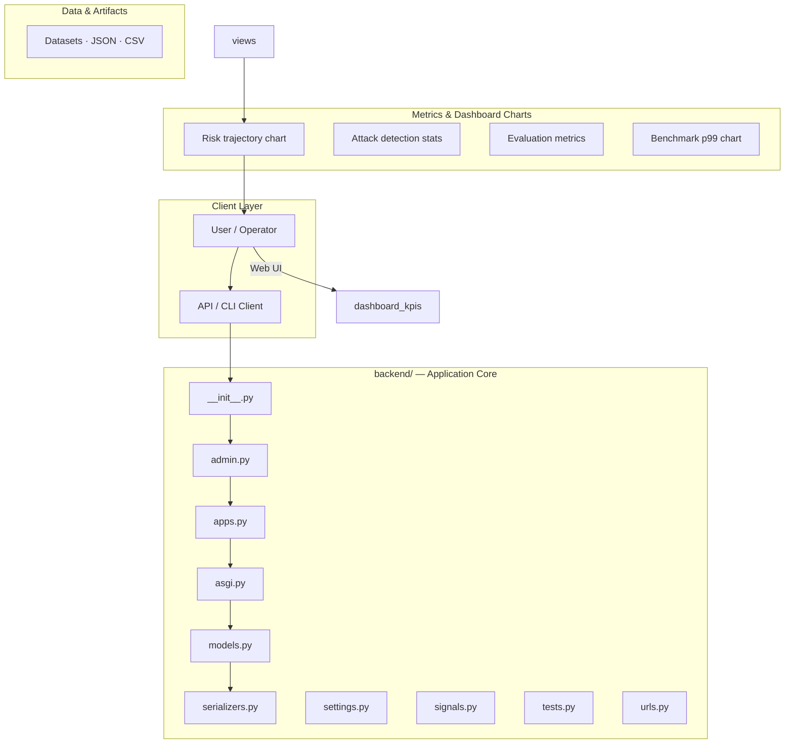
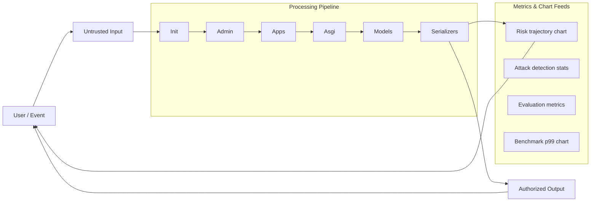
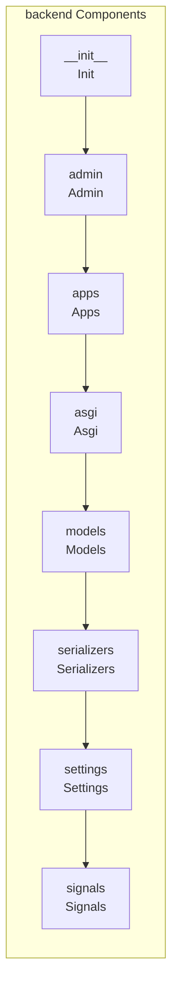
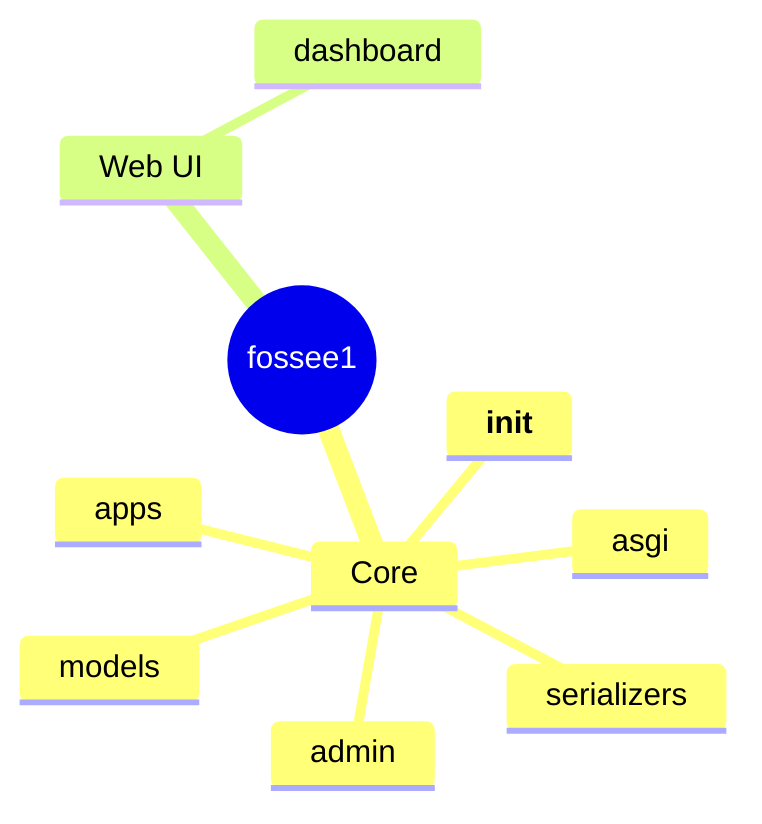

# Chemical Equipment Parameter Visualizer

A hybrid application (Web + Desktop) for visualizing and analyzing chemical equipment data from CSV uploads. Both frontends consume a shared Django REST API backend.

## Tech Stack

- **Backend:** Python Django + Django REST Framework + SQLite
- **Web Frontend:** React.js + Chart.js + Vite
- **Desktop Frontend:** PySide6 (Qt) + Matplotlib
- **Data Processing:** Pandas
- **Version Control:** Git & GitHub

## Project Structure

```
├── backend/           # Django REST API
├── web-frontend/      # React SPA
├── desktop-frontend/  # PyQt5 desktop app
├── docs/              # Screenshots, demo instructions
├── sample_equipment_data.csv  # Sample CSV for testing
└── README.md
```

## Installation

### Prerequisites

- Python 3.10+
- Node.js 18+
- pip, npm

### Backend Setup

```bash
cd backend
python -m venv venv

# Windows
.\venv\Scripts\Activate.ps1

# Linux/Mac
source venv/bin/activate

pip install -r requirements.txt
python manage.py migrate
python manage.py createsuperuser  # Optional, for admin access
python manage.py runserver
```

Backend runs at **http://localhost:8000**

### Web Frontend Setup

```bash
cd web-frontend
npm install
npm run dev
```

Web app runs at **http://localhost:5173**

### Desktop Frontend Setup

```bash
cd desktop-frontend
pip install -r requirements.txt
python main.py
```

Ensure the backend is running at `http://localhost:8000` before starting the desktop app.

## Running the Application

1. **Start Backend:** `cd backend && python manage.py runserver`
2. **Start Web (optional):** `cd web-frontend && npm run dev`
3. **Start Desktop (optional):** `cd desktop-frontend && python main.py`

## API Endpoints

| Method | Endpoint | Description |
|--------|----------|-------------|
| POST | `/api/upload/` | Upload CSV file (form field: `file`) |
| GET | `/api/datasets/` | List last 5 datasets |
| GET | `/api/datasets/{id}/` | Get dataset with full equipment list |
| GET | `/api/datasets/{id}/summary/` | Summary stats (count, avgs, min/max) |
| GET | `/api/datasets/{id}/equipment/` | Paginated equipment list |
| POST | `/api/datasets/{id}/generate-pdf/` | Generate & download PDF report |
| POST | `/api/auth/login/` | Login (username, password) → JWT |
| POST | `/api/auth/register/` | Register (username, password, email) |
| POST | `/api/auth/token/refresh/` | Refresh JWT token |

## Sample CSV File

Location: **`sample_equipment_data.csv`** (project root)

Required columns: `Equipment Name`, `Type`, `Flowrate`, `Pressure`, `Temperature`

Example:
```csv
Equipment Name,Type,Flowrate,Pressure,Temperature
Pump-A1,Centrifugal Pump,120.5,8.2,65.3
Reactor-B2,Batch Reactor,85.0,15.5,180.0
```

## Features

- **CSV Upload:** Validate structure, parse with Pandas, store in SQLite
- **Summary Stats:** Total count, averages, type distribution
- **Charts:** Bar (type distribution), Line (flowrate trends), Pie (type %)
- **Data Table:** Sortable, filterable equipment list
- **PDF Report:** Summary + type distribution + top 5 by flowrate
- **History:** Last 5 datasets (oldest auto-deleted on 6th upload)
- **Authentication:** JWT (login/register)

## Demo Video

Record a 2–3 minute video showing:
1. CSV upload from web
2. Data visualization (charts, table)
3. CSV upload from desktop
4. PDF generation
5. History feature

## License

MIT
# fossee1

## Setup Guide

### Backend Setup

_From `README.md`:_


### Prerequisites

- Python 3.10+
- Node.js 18+
- pip, npm

### Backend Setup

```bash
cd backend
python -m venv venv

# Windows
.\venv\Scripts\Activate.ps1

# Linux/Mac
source venv/bin/activate

pip install -r requirements.txt
python manage.py migrate
python manage.py createsuperuser  # Optional, for admin access
python manage.py runserver
```

Backend runs at **http://localhost:8000**

### Web Frontend Setup

```bash
cd web-frontend
npm install
npm run dev
```

Web app runs at **http://localhost:5173**

### Desktop Frontend Setup

```bash

### Frontend Setup

```bash
cd web-frontend
npm install
npm run dev     # development
npm run build && npm start   # production
```

Open `http://127.0.0.1:5173` (or the port shown in the terminal).

### Running the Application

1. **Install dependencies** in `backend/`
2. **Start web app** — `npm run dev` in `web-frontend/`

```bash
cd backend
pip install -r requirements.txt

cd web-frontend
npm install
npm run dev
```

## System Architecture

High-level system design, data flows, API map, and workflow pipelines derived from the repository structure.

### System Architecture



### Data Flow & Charts Pipeline



### Component & API Map



### Application Page Map



## Application Pages

Screenshots captured from the running application. Each page is listed with its function.

### Public

#### Login

Login — application page at `/login`


